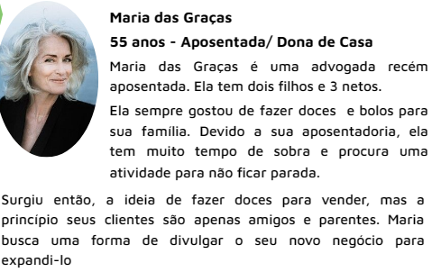
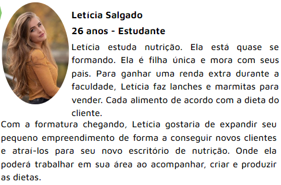
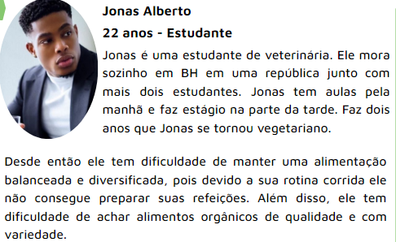
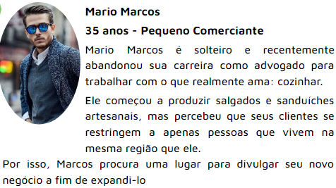
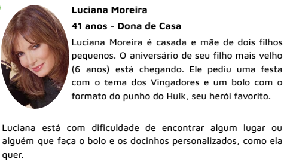
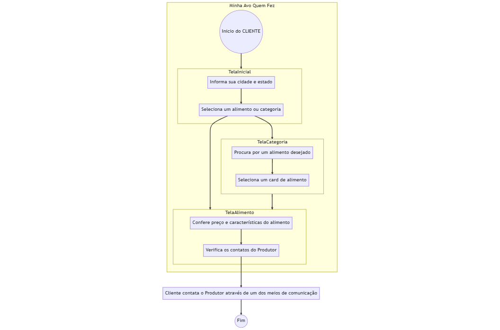
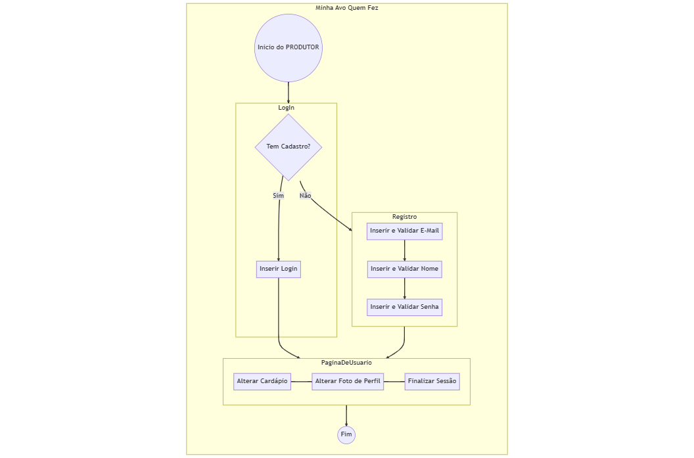

# Informações do Projeto
`TÍTULO DO PROJETO`  

Minha Avó Que Fez!

`CURSO`

Sistemas de Informação
Análise e Desenvolvimento de Sistemas

## Participantes

- Isabella Bosco Clemente
- Leonardo Ribeiro Andrade
- Lucas Henrique Simplício
- Luísa Ferreira Braz

# Estrutura do Documento

- [Informações do Projeto](#informações-do-projeto)
  - [Participantes](#participantes)
- [Estrutura do Documento](#estrutura-do-documento)
- [Introdução](#introdução)
  - [Problema](#problema)
  - [Objetivos](#objetivos)
  - [Justificativa](#justificativa)
  - [Público-Alvo](#público-alvo)
- [Especificações do Projeto](#especificações-do-projeto)
  - [Personas e Mapas de Empatia](#personas-e-mapas-de-empatia)
  - [Histórias de Usuários](#histórias-de-usuários)
  - [Requisitos](#requisitos)
    - [Requisitos Funcionais](#requisitos-funcionais)
    - [Requisitos não Funcionais](#requisitos-não-funcionais)
  - [Restrições](#restrições)
- [Projeto de Interface](#projeto-de-interface)
  - [User Flow](#user-flow)
  - [Wireframes](#wireframes)
- [Metodologia](#metodologia)
  - [Divisão de Papéis](#divisão-de-papéis)
  - [Ferramentas](#ferramentas)
  - [Controle de Versão](#controle-de-versão)
- [**############## SPRINT 1 ACABA AQUI #############**](#-sprint-1-acaba-aqui-)
- [Projeto da Solução](#projeto-da-solução)
  - [Tecnologias Utilizadas](#tecnologias-utilizadas)
  - [Arquitetura da solução](#arquitetura-da-solução)
- [Avaliação da Aplicação](#avaliação-da-aplicação)
  - [Plano de Testes](#plano-de-testes)
  - [Ferramentas de Testes (Opcional)](#ferramentas-de-testes-opcional)
  - [Registros de Testes](#registros-de-testes)
- [Referências](#referências)

# Introdução

## Problema

Para pequenos empreendedores, o mercado alimentício, ainda que muito grande, é uma casca dura de se adentrar.
Nos aplicativos consolidados, pequenos empreendedores de comidas artesanais se vêem competindo contra aqueles de maior porte,
e dificilmente conseguem conquistar novos clientes

Além disso, os consumidores de produtos orgânicos/não industrializados passam aperto ao procurar por produtores de confiança, os quais ele possam entrar em contato e que mostrem os ingredientes que usam em seus produtos.

## Objetivos

O nosso principal objetivo é desenvolver uma solução de software que atenda aos pequenos produtores de alimentos artesanais,
auxiliando-os a crescer ou até mesmo a criar seu próprio pequeno negócio. De maneira conjunta,
procuramos também auxiliar aos consumidores que procuram um estilo de alimentação onde a produção seja mais orgânica e feita a sua maneira.
Seja para sanduíches naturais, seja para bolos de cenoura com chocolate.

## Justificativa

Assim como vários talentos da alimentação artesanal são ignorados, vários clientes têm dificuldades em encontrar
alimentos orgânicos e artesanais à sua maneira, contentando-se então com aqueles
alimentos encontrados em padarias ou lanchonetes que talvez não atendam a seus gostos.

Vale também relembrar que várias pessoas de idade avançada possuem grandes habilidades e prazer com confeitaria, mas
tem dificuldades em começar um negócio próprio.

## Público-Alvo

Produtores de alimentos orgânicos/caseiros que buscam novos clientes ou que desejam começar um negócio, mas não possuem grande conhecimentos tecnológicos para divulgar tais serviços de maneira efetiva.

Consumidores de alimentos orgânicos e/ou caseiros que desejam encontrar bons produtores, seja para consumo pessoal, para eventos, etc, a preços acessíveis; assim como aqueles que desejam alimentos com ingredientes/aparência escolhidos a dedo.
 
# Especificações do Projeto

## Personas e Mapas de Empatia

## Histórias de Usuários

Com base na análise das personas forma identificadas as seguintes histórias de usuários:

|EU COMO... `PERSONA`| QUERO/PRECISO ... `FUNCIONALIDADE` |PARA ... `MOTIVO/VALOR`                 |
|--------------------|------------------------------------|----------------------------------------|
|Empreendedor|Uma plataforma chamativa|Para divulgar meus trabalhos|
|Empreendedor|Uma interface simples e intuitiva|Mexer no dia-a-dia|
|Empreendedor|Registrar meu cardápio com imagens|Atrair clientes|
|Empreendedor|De um sistema de avaliações|Me destacar dos outros empreendedores|
|Empreendedor|Segurança contra pessoas mal-intencionadas|Não ser prejudicado no site|
|Consumidor|Prestigiar um empreendedor|Melhorar o filtro do site|
|Consumidor|Um mapa dos profissionais locais|Poder me comunicar melhor|
|Consumidor|Uma plataforma sem login|Não ter comprometimento com o site|
|Consumidor|Uma forma de reportar empreendedores|Evitar calotes futuros|

## Requisitos

As tabelas que se seguem apresentam os requisitos funcionais e não funcionais que detalham o escopo do projeto.

### Requisitos Funcionais
|Descrição do Requisito|Prioridade|
|----------------------|----------|
|O empreendedor pode realizar Login e alterar seus dados cadastrais|ALTA
|O empreendedor pode criar e alterar o cardápio em sua página de perfil|ALTA
|O empreendedor pode gerar apenas três links para avaliação por dia|MÉDIA
|O cliente pode visualizar o contato dos empreendedores|ALTA
|O cliente pode visualizar os ingredientes de cada produto|ALTA
|O cliente pode prestigiar os empreendedores com troféus|MÉDIA
|O cliente pode avaliar o empreendedor APENAS uma única vez|ALTA
|A interface deve ser simples para atender pessoas com pouco ou nenhum conhecimento em tecnologia|ALTA
|Deve haver um mapa na página principal para ajudar o cliente a localizar empreendedores em sua área|MÉDIA
|Os produtos devem ser separados de acordo com seu tipo|BAIXA
|Os troféus de prestígio possuem ranks de acordo com o número de avaliações|BAIXA

### Requisitos não Funcionais

|ID     | Descrição do Requisito  |Prioridade |
|-------|-------------------------|----|
|RNF-001|O sistema deve ser responsivo para rodar em um dispositivos móvel|MÉDIA|

## Restrições

O projeto está restrito pelos itens apresentados na tabela a seguir.

|ID| Restrição                                             |
|--|-------------------------------------------------------|
|01|O projeto deverá ser entregue até o final do semestre|
|02|O projeto deve exigir Registro e Login APENAS PARA PRODUTORES|

# Projeto de Interface

## User Flow

## Wireframes

......  INCLUA AQUI OS WIREFRAMES DAS TELAS DA APLICAÇÃO COM UM BREVE DESCRITIVO ......

# Metodologia

Nossa metodologia de trabalho se assemelha ao SCRUM, com equipes auto organizáveis e multidisciplinares. Os planejamentos futuros serão feitos virtualmente quando iniciarmos o processo de desenvolvimento do código. Nesse processo serão gerados artefatos como backlogs e códigos HTML. Realizaremos reuniões semanais para verificar o avanço de cada um na sua própria parte da Sprint atual.

## Divisão de Papéis

|Nome|Tarefas|
|---|---|
|Isabella Bosco|Introdução, Especificações do Projeto, Slides de Apresentação|
|Leonardo Ribeiro|Introdução, Especificações do Projeto, Projeto de Interface, Arquivo Markdown|
|Lucas Henrique|Introdução, Metodologia|
|Luísa Ferreira|Introdução, Projeto de Interface|

## Ferramentas

| Ambiente  | Plataforma              |Link de Acesso |
|-----------|-------------------------|---------------|
|Repositório de Código|GitHub|https://github.com/PSG-TIAPN-2022-1/psg-tiapn-2023-1-minha-avo-que-fez
|Editor de Código|Visual Studio Code|(Não se aplica)
|Ferramenta de Comunicação|WhatsApp|(Não se aplica)
|Hospedagem do Site|GitHub Pages|https://github.com/PSG-TIAPN-2022-1/psg-tiapn-2023-1-minha-avo-que-fez
|Ferramenta de Diagramação|Mermaid|(Não se aplica)
|Ferramenta pro Wireframe|Diagrams|(Não se aplica)
|Ferramenta de Controle de Versão|Git|(Não se aplica)

Escolhemos o GitHub como repositório do código por indicação do professor e por termos utilizado ele no passado. O Visual Studio Code por todos no grupo utilizá-lo e pelas suas extensões úteis e fáceis de utilizar. WhatsApp por ser uma ferramenta de comunicação simples que todos usam, além de ter chamadas em grupo para facilitar a comunicação. GitHub Pages por termos usado ele em projetos passados. Mermaid pela eficiência de escrever um código e gerar um diagrama. Diagrams por ser um programa leve, gratuito e simples de utilizar. Git por indicação do professor.

## Controle de Versão

Utilizaremos o Git como aplicativo de controle de versão por ser de graça e uma indicação do professor. 
O projeto vai seguir a seguinte convenção para o nome de branchs:
master: versão estável já testada do software
unstable: versão já testada do software, porém instável
testing: versão em testes do software
dev: versão de desenvolvimento do software
E quanto à gerência de issues, o projeto adota a seguinte convenção para etiquetas:
bugfix: uma funcionalidade encontra-se com problemas
enhancement: uma funcionalidade precisa ser melhorada
feature: uma nova funcionalidade precisa ser introduzida

# **############## SPRINT 1 ACABA AQUI #############**

# Projeto da Solução

......  COLOQUE AQUI O SEU TEXTO ......

## Tecnologias Utilizadas

......  COLOQUE AQUI O SEU TEXTO ......

> Descreva aqui qual(is) tecnologias você vai usar para resolver o seu
> problema, ou seja, implementar a sua solução. Liste todas as
> tecnologias envolvidas, linguagens a serem utilizadas, serviços web,
> frameworks, bibliotecas, IDEs de desenvolvimento, e ferramentas.
> Apresente também uma figura explicando como as tecnologias estão
> relacionadas ou como uma interação do usuário com o sistema vai ser
> conduzida, por onde ela passa até retornar uma resposta ao usuário.
> 
> Inclua os diagramas de User Flow, esboços criados pelo grupo
> (stoyboards), além dos protótipos de telas (wireframes). Descreva cada
> item textualmente comentando e complementando o que está apresentado
> nas imagens.

## Arquitetura da solução

......  COLOQUE AQUI O SEU TEXTO E O DIAGRAMA DE ARQUITETURA .......

> Inclua um diagrama da solução e descreva os módulos e as tecnologias
> que fazem parte da solução. Discorra sobre o diagrama.
> 
> **Exemplo do diagrama de Arquitetura**:
> 
> 

# Avaliação da Aplicação

......  COLOQUE AQUI O SEU TEXTO ......

> Apresente os cenários de testes utilizados na realização dos testes da
> sua aplicação. Escolha cenários de testes que demonstrem os requisitos
> sendo satisfeitos.

## Plano de Testes

......  COLOQUE AQUI O SEU TEXTO ......

> Enumere quais cenários de testes foram selecionados para teste. Neste
> tópico o grupo deve detalhar quais funcionalidades avaliadas, o grupo
> de usuários que foi escolhido para participar do teste e as
> ferramentas utilizadas.
> 
> **Links Úteis**:
> - [IBM - Criação e Geração de Planos de Teste](https://www.ibm.com/developerworks/br/local/rational/criacao_geracao_planos_testes_software/index.html)
> - [Práticas e Técnicas de Testes Ágeis](http://assiste.serpro.gov.br/serproagil/Apresenta/slides.pdf)
> -  [Teste de Software: Conceitos e tipos de testes](https://blog.onedaytesting.com.br/teste-de-software/)

## Ferramentas de Testes (Opcional)

......  COLOQUE AQUI O SEU TEXTO ......

> Comente sobre as ferramentas de testes utilizadas.
> 
> **Links Úteis**:
> - [Ferramentas de Test para Java Script](https://geekflare.com/javascript-unit-testing/)
> - [UX Tools](https://uxdesign.cc/ux-user-research-and-user-testing-tools-2d339d379dc7)

## Registros de Testes

......  COLOQUE AQUI O SEU TEXTO ......

> Discorra sobre os resultados do teste. Ressaltando pontos fortes e
> fracos identificados na solução. Comente como o grupo pretende atacar
> esses pontos nas próximas iterações. Apresente as falhas detectadas e
> as melhorias geradas a partir dos resultados obtidos nos testes.

# Referências

......  COLOQUE AQUI O SEU TEXTO ......

> Inclua todas as referências (livros, artigos, sites, etc) utilizados
> no desenvolvimento do trabalho.
> 
> **Links Úteis**:
> - [Formato ABNT](https://www.normastecnicas.com/abnt/trabalhos-academicos/referencias/)
> - [Referências Bibliográficas da ABNT](https://comunidade.rockcontent.com/referencia-bibliografica-abnt/)